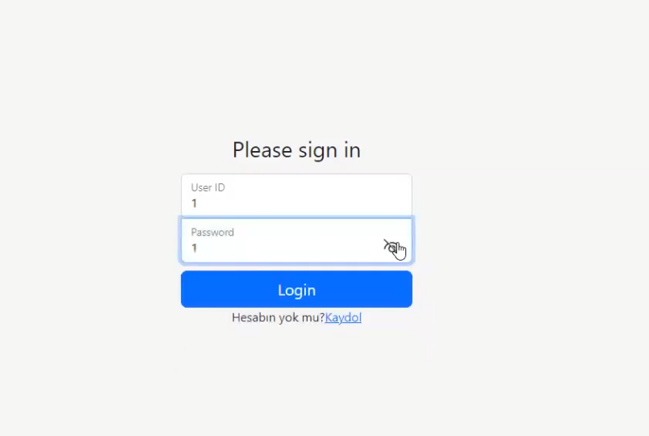
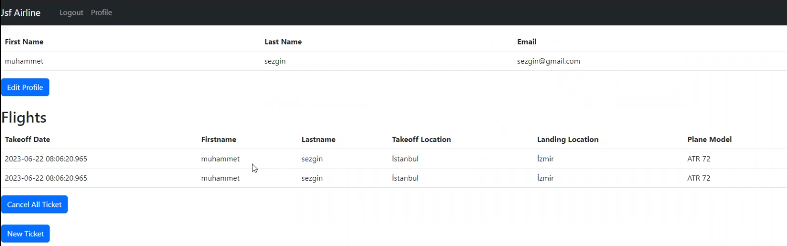
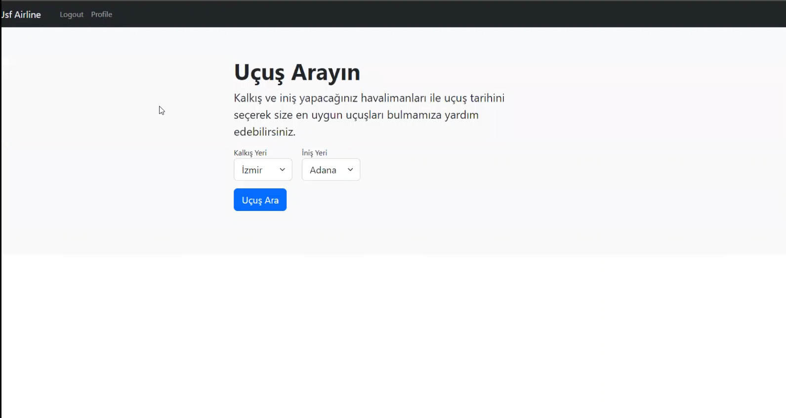
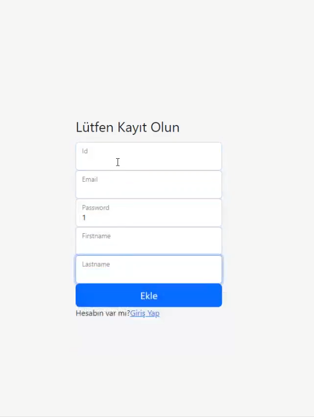

# Airline-Automation
JThe purpose of the project is to ensure the correct implementation of CRUD operations on the backend using JSF, MYSQL, and GlassFish Server. 
The team aims to establish a proper division of labor to achieve the project goals.

